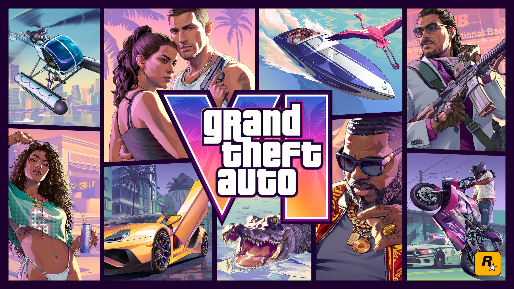
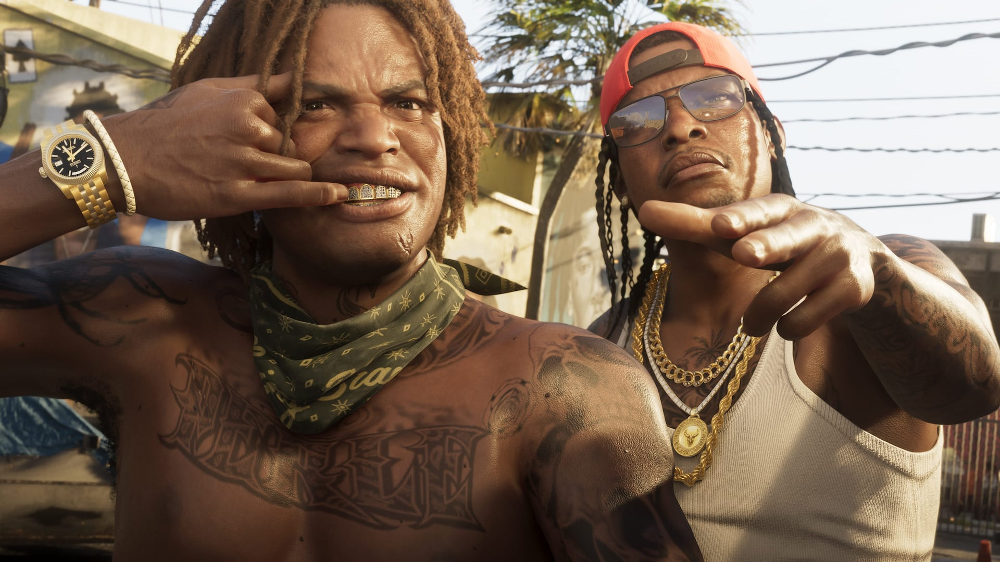
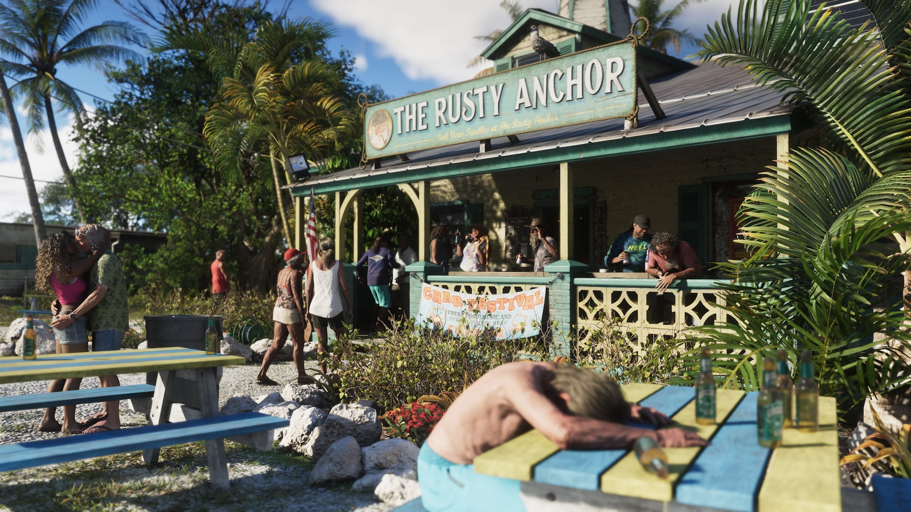
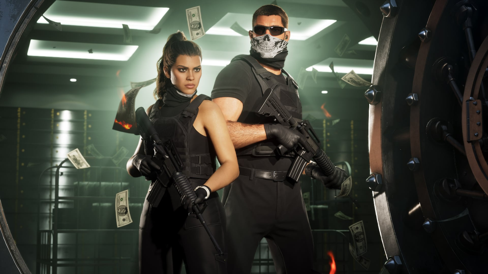
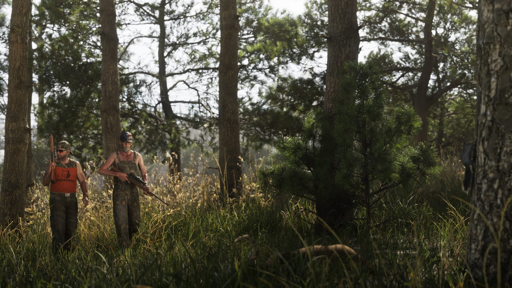

<div align="center">


<br/>

<a href="#-experience">
  
</a>

<br/><br/>



<br/><br/>

[](https://nextjs.org/)
[](https://react.dev/)
[](https://www.typescriptlang.org/)
[](https://tailwindcss.com/)
[](https://gsap.com/)
[](https://threejs.org/)

<br/>

**A cinematic GTA VI fan-made web experience built around motion, scroll, 3D, atmosphere, and visual storytelling.**

</div>

---

## 🌴 About

**Vice City Awaits** is an unofficial, fan-made **Grand Theft Auto VI** interactive website created as a front-end showcase.

This project is intentionally not designed like a traditional gaming landing page. The experience is built as a sequence of cinematic chapters: a scrubbed opening video, editorial transitions, an interactive 3D scene, a live release countdown, Leonida exploration, character storytelling, trailers, gallery sequences, hardware information, a timeline, and a cinematic ending.

> **Make scrolling feel like entering the world — not browsing a template.**

---

## 🎬 Experience

<table>
<tr>
<td width="50%">

### 🎞 Scroll-Scrubbed Opening
The hero video is tied directly to scroll progression using **GSAP + ScrollTrigger**, creating a frame-driven cinematic entrance instead of a standard autoplay hero.

### 🧊 Interactive 3D Chapter
A real-time **GLB** scene powered by **React Three Fiber**, `@react-three/drei`, and Three.js — integrated directly into the visual narrative.

### ⏳ Live Release Countdown
A dramatic real-time countdown chapter designed as typography and motion, not a generic group of cards.

</td>
<td width="50%">

### 🌅 Explore Leonida
Scroll-driven visual storytelling across Vice City, Leonida Keys, Port Gellhorn, Grassrivers, Mount Kalaga and more.

### 🎥 Trailer Cinema
Official trailer presentation wrapped in a cinematic theatre-style interface.

### 🕒 Interactive Timeline
A motion-driven timeline for the road to GTA VI, plus game information, platforms, hardware guidance and updates.

</td>
</tr>
</table>

---

## 📸 Visual World

<div align="center">

<table>
<tr>
<td></td>
<td></td>
</tr>
<tr>
<td></td>
<td></td>
</tr>
</table>

<sub>Official promotional artwork used by this fan-made project remains the property of its respective rights holders.</sub>

</div>

---

## ✨ What Makes It Different

- **Scroll as a controller** — motion is choreographed around the user's movement.
- **Cinematic pinning** — chapters hold, transform, and transition rather than simply stacking.
- **Real-time WebGL** — a physical-feeling GTA VI art piece rendered inside the page.
- **Vice City lighting language** — black, magenta, violet, orange, and sunset tones.
- **Custom motion direction** — section-specific GSAP timelines instead of repetitive fade-up animations.
- **Responsive fallback design** — desktop choreography adapts for tablet and mobile instead of just shrinking.
- **Performance-conscious rendering** — controlled video seeking, model preloading, responsive media, and WebGL lifecycle work.
- **Verified-content mindset** — unofficial or unconfirmed information is kept separate from official facts.

---

## 🧭 Experience Flow

```mermaid
flowchart LR
    A[Preloader] --> B[Scroll-Scrub Video]
    B --> C[Cinematic Transition]
    C --> D[GTA VI Intro]
    D --> E[3D Model Chapter]
    E --> F[Release Countdown]
    F --> G[Leonida World]
    G --> H[Characters]
    H --> I[Trailer Cinema]
    I --> J[Gallery]
    J --> K[Game Info]
    K --> L[Platforms]
    L --> M[Hardware]
    M --> N[Requirements]
    N --> O[Timeline]
    O --> P[News]
    P --> Q[Final Moment]
```



---

## 🛠 Tech Stack

| Layer | Technology |
|---|---|
| Framework | **Next.js 16 — App Router** |
| UI | **React 19 + TypeScript** |
| Styling | **Tailwind CSS 4** |
| Motion | **GSAP + @gsap/react + ScrollTrigger** |
| Smooth Scroll | **Lenis** |
| 3D | **Three.js + React Three Fiber + Drei** |
| Additional Motion | **Motion** |
| Images | **Next/Image + local optimized assets** |
| Tooling | **ESLint + TypeScript** |

---

## 🧩 Project Architecture

```text
gta6-vice-city/
├── app/
├── components/
│   ├── layout/
│   ├── sections/
│   ├── system/
│   ├── three/
│   ├── ui/
│   └── video/
├── config/
├── data/
├── hooks/
├── lib/
├── public/
│   ├── images/
│   │   ├── characters/
│   │   ├── gallery/
│   │   └── world/
│   ├── models/
│   └── videos/
├── package.json
└── README.md
```

---

## 🚀 Run Locally

```bash
git clone https://github.com/salah-alstre/gta6-vice-city.git
cd gta6-vice-city
npm install
npm run dev
```

Open `http://localhost:3000`

Production check:

```bash
npm run lint
npm run build
npm run start
```

---

## ⚡ Performance Notes

This experience combines **video seeking, ScrollTrigger pinning, WebGL, large imagery, and continuous motion**, so performance is treated as part of the design.

- GLB preloading and caching
- Scroll-aware video playback
- Controlled React render frequency
- GSAP lifecycle cleanup
- Responsive ScrollTrigger behavior
- Device-aware 3D composition
- Optimized local imagery
- Reduced-motion considerations
- Lenis + ScrollTrigger coordination

---

## 🎨 Art Direction

<div align="center">

`BLACK` · `VICE PINK` · `MAGENTA` · `VIOLET` · `SUNSET ORANGE`

<br/><br/>

**Cinematic. Editorial. Dark. Neon-lit. Responsive. Interactive.**

</div>

The interface intentionally avoids generic SaaS layouts, random gradient blobs, repetitive fade-ins, standard gaming dashboards, and the usual “hero + cards + footer” structure.

---

## 🧊 3D Credit

**Model:** *Grand Theft Auto 6*  
**Creator:** Fabio Rinaldo Roloff  
**Source:** Sketchfab  
**License:** CC BY 4.0

Please preserve required attribution if the model remains part of a fork or derivative version of this project.

---

## ⚠️ Disclaimer

> **Vice City Awaits is an unofficial fan-made project.**

This repository and its creator are **not affiliated with, endorsed by, or sponsored by Rockstar Games or Take-Two Interactive**.

**Grand Theft Auto**, **Grand Theft Auto VI**, related names, logos, characters, artwork, trailers, and promotional material are trademarks and/or copyrighted works of their respective owners.

This project was created as a **non-official front-end / interactive web development showcase**.

---

## 👨‍💻 Author

<div align="center">

### Salah Alstre

Built as a creative front-end experiment focused on **Next.js, GSAP, Three.js, cinematic motion, and interactive storytelling**.

[](https://github.com/salah-alstre)

<br/>


</div>
